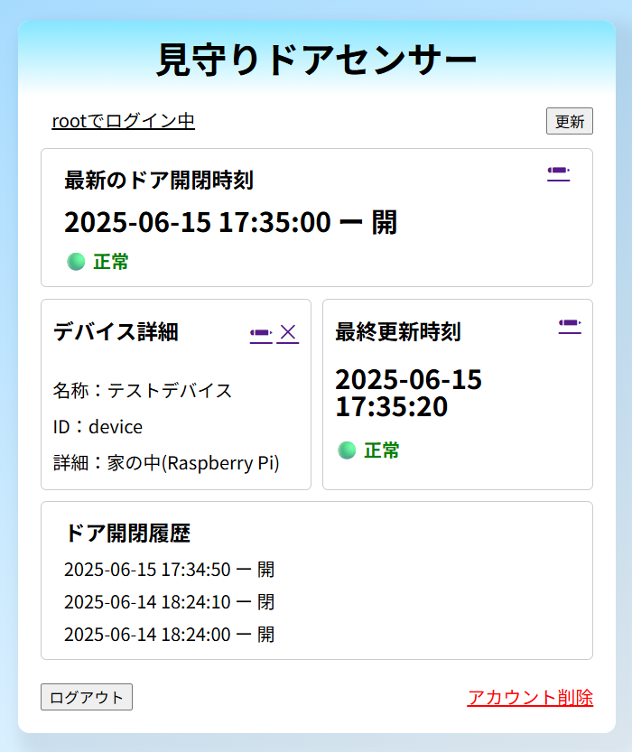
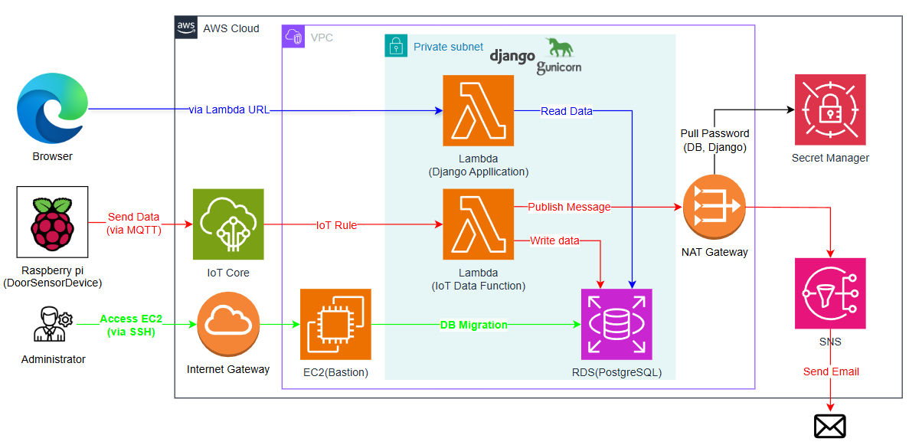

# IoT Django App on AWS

Raspberry Piで取得したドア開閉センサーデータを、MQTTを通じてAWS Lambdaへ送信し、Django + RDS(PostgreSQL)で可視化するIoTシステムです。<br>
AWS SAMとDockerを活用し、サーバーレス構成で運用可能です。

> 本プロジェクトについて<br>
このリポジトリは、[@fun-with-serverless](https://github.com/fun-with-serverless) 氏の [serverless-django](https://github.com/fun-with-serverless/serverless-django) を参考に、自身の学習・ポートフォリオ目的で構築・改修したものです。<br>
MITライセンスに基づいて改変・公開しています。  詳細は [`LICENSE`](LICENSE) をご確認ください。


## 想定ユースケース： 「見守りドアセンサー」

- 倉庫・プラント・自宅のドアの開閉状況を常時記録
- ドアの開閉時にメール通知を行うほか、通信断を死活監視
- 出先からもクラウド経由で履歴確認
- 複数ユーザーがそれぞれのデバイスを個別に管理可能


## 画面イメージ




## システム概要

- **センサーデバイス**：Raspberry Pi の GPIO でドアの開閉を検知
- **通信**：MQTT を通じて AWS IoT Core に送信
- **処理**：AWS Lambda がメッセージを受信し、RDS（PostgreSQL）に保存
- **可視化**：Djangoから開閉履歴や現在の状態を確認
- **ユーザー管理**：Djangoでユーザーごとにデバイスの登録・管理が可能 
- **インフラ構築**：AWS SAM によるサーバーレスデプロイ


## 技術スタック

| レイヤー          | 使用技術                                      |
|------------------|----------------------------------------------|
| 言語             | Python 3                                     |
| IoTデバイス       | Raspberry Pi（GPIO）                         |
| 通信プロトコル     | MQTT（AWS IoT Core 経由）                    |
| バックエンド       | Django, Gunicorn                             |
| コンテナ環境       | Docker, Docker Compose                        |
| データベース       | PostgreSQL（Amazon RDS）                      |
| クラウド環境       | AWS Lambda（コンテナイメージ）, Secrets Manager, SAM |
| 開発・運用ツール    | AWS SAM CLI, GitHub, Poetry                   |


## アーキテクチャー




## クイックスタート（ローカル開発）

以下の手順でローカル環境を立ち上げることができます。

```bash
git clone https://github.com/Nikitty1226/IoT-django-app-on-aws.git
cd IoT-django-app-on-aws
docker-compose up -d
docker-compose exec app python manage.py migrate
```
完了後、以下にアクセスしてください。<br>
http://localhost:8000


## AWS へのデプロイ

以下のコマンドで SAM を使って AWS にデプロイできます。

```bash
pip install -r requirements.txt -t iot_data_lambda/
sam build
sam deploy --guided
```
### 事前に必要なもの

- AWS CLI の認証情報
- S3 バケット（SAMが利用するアーティファクト格納先）
- EC2 キーペア名（踏み台サーバーへのSSH接続に使用）
- `template.yaml` に定義されたParameters、region等の確認・変更（sam deploy時に使用）

詳細は[serverless-django](https://github.com/fun-with-serverless/serverless-django)をご覧ください。


## フォルダ構成

```text
├── images/                    # README用画像
├── iot/                       # Djangoプロジェクトルート
│   ├── iot/                   # プロジェクト設定（settings.pyなど）
│   └── iot_app/               # アプリケーション本体
├── iot_data_lambda/           # IoTデータ受信用のLambda関数
├── docker-compose.yml         # ローカル開発用Compose定義
├── Dockerfile                 # Django用Docker設定
├── pyproject.toml             # Poetryの設定ファイル
├── README.md                  # 本ドキュメント
├── requirements.txt           # Lambda関数用の依存関係（pip用）
└── template.yaml              # AWS SAM テンプレート
```


## クラウド利用時の注意点

このプロジェクトをAWS上で実際に利用するには、以下の構成要素について**手動設定が必要**です。

- **IoT Core での「モノ（Thing）」 ・証明書の発行とアタッチ**  
  デバイスごとに証明書を作成し、適切なポリシーを割り当ててください。  
  ※ 証明書ファイルはデバイスに埋め込む必要があります。詳細は以下のリポジトリを参照してください： [DoorSensorDevice（Raspberry Pi用スクリプト）](https://github.com/Nikitty1226/DoorSensorDevice)

- **MQTT のトピック設計に関するルール**  
  デバイスから送信するMQTTトピックには、**sensor/GUI上で設定したデバイスID**で設定する必要があります。  
  例：`sensor/abc123`（abc123 は Django 上で登録した device_id）

- **SNS トピックとサブスクリプションの作成**  
  メール通知を利用する場合は、SNSトピックを作成し、メールアドレスを購読者として登録・確認してください。  
  またトピック名は、**SNSトピック名 = デバイスID** としてください。※ Lambda関数内でトピック名とデバイス名を照合しているため


## 引用元プロジェクト/ライセンス

本プロジェクトは以下のオープンソースを参考にしています。

- [fun-with-serverless/serverless-django](https://github.com/fun-with-serverless/serverless-django)  
  © [@fun-with-serverless](https://github.com/fun-with-serverless) - MITライセンス

MITライセンスに基づいて改変・公開しています。詳細は [`LICENSE`](LICENSE) をご確認ください。


## 作者

**Masayoshi Niki**  
IoT技術者／クラウドアプリエンジニア志望<br>
GitHub: [@Nikitty1226](https://github.com/Nikitty1226)


## 補足：関連リポジトリ

デバイス（Raspberry Pi）で動作するセンサースクリプトは、以下の別リポジトリにて管理しています。

- [DoorSensorDevice (Raspberry Pi用スクリプト)](https://github.com/Nikitty1226/DoorSensorDevice)

このスクリプトでは以下を実装しています。

- GPIO によるドア開閉検知
- MQTT による IoT Core へのメッセージ送信
- 再接続・ロギング・タイマー送信処理 など
